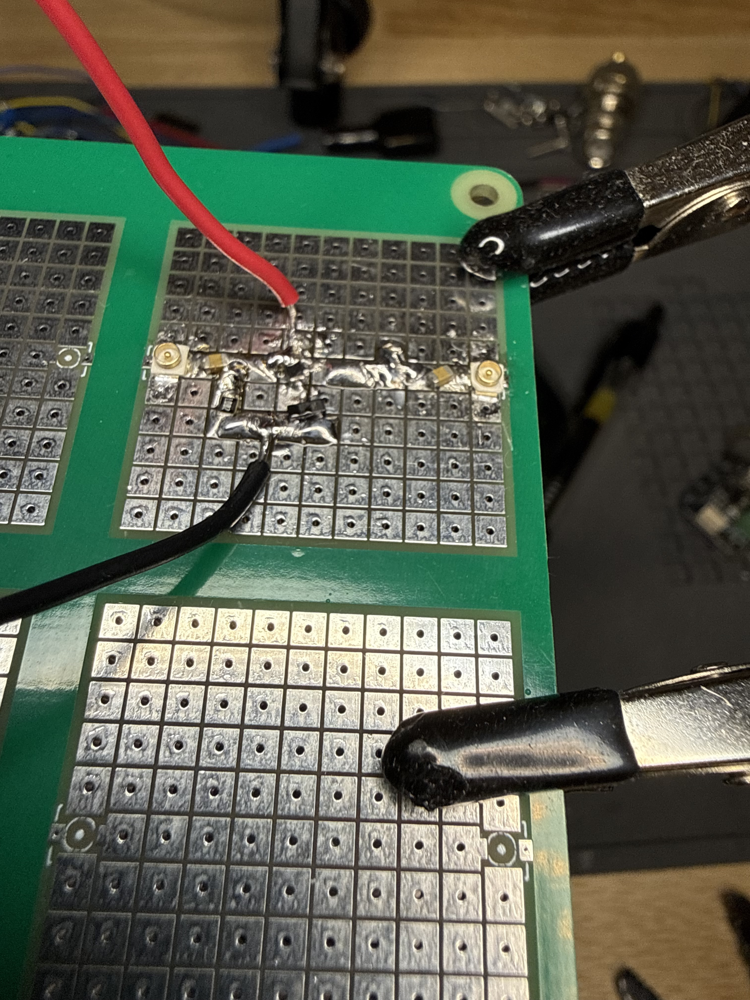
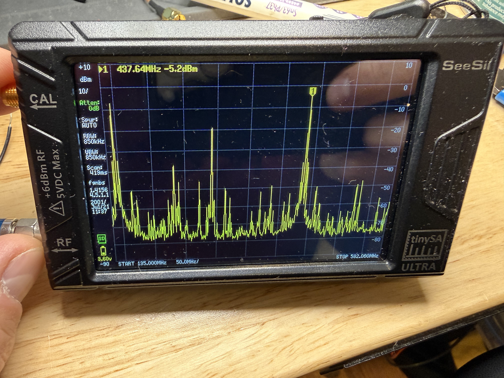
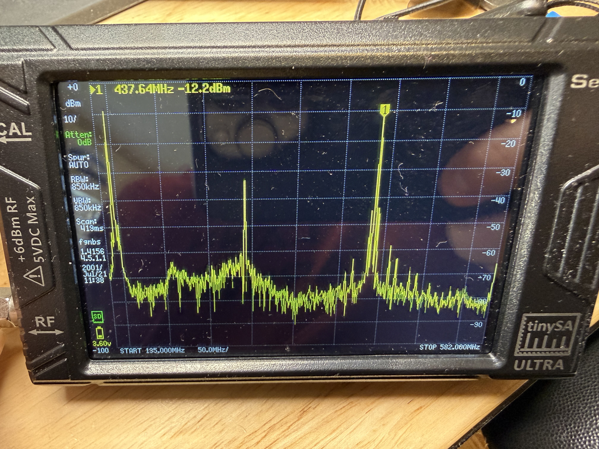
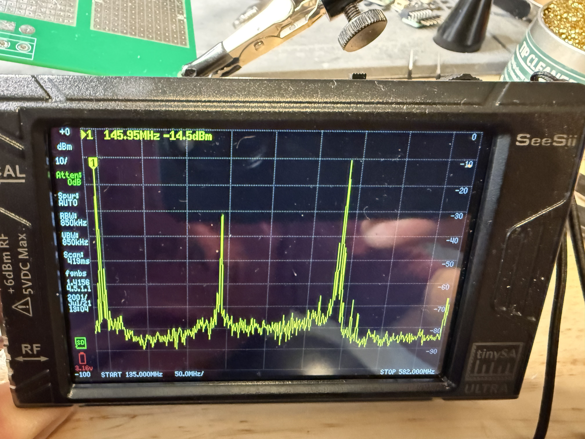

# Frequency Tripler Prototype Build

## Objective
Verify 3rd harmonic generation: 145.667 MHz in → 437 MHz out, using a 2N3904
in class-C configuration. This test skips the XOR modulator (not yet available)
and drives the tripler directly from the Si5351A CLK0 output.

## Schematic

```
Si5351A CLK0                     Vcc (3.3V from Pico)
(145.667 MHz)                     |
     |                          RFC (220 nH)
     |                            |
     +──[100nF]──┬────────────── Collector ──[100nF]──→ SMA → TinySA
                 |                |
              10kΩ              (2N3904)
              to GND              |
                 |              Emitter
                 +────────────── GND
                Base
```

Simplified for clarity:
- Input coupling cap: 100 nF (DC blocks, passes RF)
- Base bias: 10 kΩ to GND (sets class-C — transistor off at DC, conducts on
  positive peaks only)
- Collector: RFC to Vcc, AC-coupled output through 100 nF
- Emitter: directly to GND

## 2N3904 Pinout

### SOT-23 (SMD — most common SMD package for 2N3904)
```
    ┌──────┐
  1 │•     │ 3
    │      │
  2 │      │
    └──────┘
```
Pin 1 = Base, Pin 2 = Emitter, Pin 3 = Collector.
Marking is usually "1A" or "2A" — check your specific part's datasheet.

### TO-92 (through-hole, flat side facing you)
```
   ┌───┐
   │   │
  E  B  C
```

**Always verify pinout against your part's datasheet** — different
manufacturers sometimes swap pins.

## Parts List

| Part | Value | Notes |
|------|-------|-------|
| Q1 | 2N3904 | NPN, TO-92. ft = 300 MHz |
| C1 (input coupling) | 100 nF | Ceramic. Blocks DC from Si5351 output |
| C2 (output coupling) | 100 nF | Ceramic. Blocks DC from collector bias |
| R1 (base bias) | 10 kΩ | Sets class-C operating point. Start here, adjust later |
| L1 (RFC) | 220 nH | RF choke — blocks RF from entering power supply |
| Power | 3.3V | From Pico 3V3 pin, or separate 3.3V supply |

### What's an RFC?

RFC = Radio Frequency Choke. It's just an inductor used to block RF signals
from reaching the DC power supply. At 145 MHz, 220 nH presents ~200 Ohms of
impedance (Z = 2 * pi * f * L), so RF "sees" a wall and goes out the output
cap instead. DC current flows through it freely to bias the collector.

If you don't have a 220 nH inductor specifically, anything in the 100-330 nH
range will work for this test. Even a small ferrite bead might do in a pinch.
What matters is that it has high impedance at 145 MHz and low impedance at DC.

### What if I don't have 100 nF caps?

Any value from 10 nF to 1 uF works fine. These are just DC blocking caps —
at 145 MHz even 1 nF has < 2 Ohms impedance. Use whatever ceramic caps you
have handy.

## Build Procedure

### Step 1 — Check your parts

Verify you have: 2N3904, 10 kΩ resistor, two capacitors (~100 nF), an
inductor (~220 nH), and a way to get CLK0 from the Si5351A to the breadboard.

For CLK0 connection: the Adafruit breakout has header pins for CLK0. Use a
short jumper wire (< 2 inches / 50 mm) from the CLK0 header pin to the
breadboard. Shorter is better at VHF — every inch of wire is an antenna.

### Step 2 — Build the circuit

On the RF proto board:

1. Place the 2N3904 (SOT-23) and tack-solder one pad.
2. Identify B, E, C. Connect Emitter pad to the ground plane.
3. Solder 10 kΩ (0805) from Base pad to ground.
4. Solder input coupling cap (100 nF, 0805) in line from input pad to Base.
5. Solder RFC (220 nH, 0805) from Vcc pad to Collector.
6. Solder output coupling cap (100 nF, 0805) from Collector to output pad/SMA.
7. Add a bypass cap (100 nF, 0805) from Vcc to GND close to the RFC — keeps
   RF out of the power supply.

Keep the signal path linear: input on one side, transistor in the middle,
output on the other side. Ground connections should go straight down to the
ground plane through vias or edge pads — avoid long ground return paths.

### Step 3 — Power up and measure

1. Power up the Pico + Si5351A (from the previous bring-up test).
2. Confirm CLK0 is running at 145.667 MHz (`s` in serial console).
3. Connect TinySA to the tripler output (through SMA cable or probe).
4. Set TinySA span: **100 MHz to 800 MHz** to see the full harmonic spectrum.

### Step 4 — What to look for

You should see peaks at:

| Harmonic | Frequency | Expected relative level | Notes |
|----------|-----------|------------------------|-------|
| 1st (fundamental) | 145.67 MHz | Strongest | This is what we want to filter out |
| 2nd | 291.3 MHz | -6 to -10 dB below fundamental | Even harmonic, lower in class-C |
| **3rd** | **437.0 MHz** | **-10 to -20 dB below fundamental** | **This is our target** |
| 4th | 582.7 MHz | Weak | Will be filtered |
| 5th | 728.3 MHz | Very weak | Will be filtered |

With a 2N3904 (ft = 300 MHz), the 3rd harmonic will be weaker than with a
higher-ft transistor. Expect roughly **-15 to -10 dBm** at 437 MHz if
input is +10 dBm. This is fine — the MMIC amplifier adds 15-20 dB later.

If you see NO 3rd harmonic:
- Check that the collector has DC voltage (should be near Vcc through the RFC)
- Check that the base is getting signal (probe with scope)
- Try reducing R1 to 4.7 kΩ — this increases conduction angle which may help
  if the Si5351A output swing isn't enough to turn on the transistor cleanly

### Step 5 — Optimize bias

The 10 kΩ base resistor sets the class-C bias point. Tuning it trades off
between total output power and harmonic content:

- **Higher R (22 kΩ, 47 kΩ):** Deeper class-C. Transistor barely conducts →
  more harmonics relative to fundamental, but less total power.
- **Lower R (4.7 kΩ, 2.2 kΩ):** Shallower class-C, approaching class-B.
  More total power but more fundamental, less 3rd harmonic relative to total.
- **Goal:** Maximize the absolute power at 437 MHz. Not the ratio — the
  absolute level.

Try a few values and record the 437 MHz power level on TinySA:

| R1 value | 145.67 MHz | 291.3 MHz | 437.0 MHz | Notes |
|----------|------------|-----------|-----------|-------|
| 4.7 kΩ   |            |           |           |       |
| 10 kΩ    |            |           |           |       |
| 22 kΩ    |            |           |           |       |
| 47 kΩ    |            |           |           |       |

### Step 6 — Frequency sweep test

Use the serial console `+`/`-` commands to shift CLK0 and verify the 3rd
harmonic tracks: a 100 kHz step at 145.67 MHz should produce a 300 kHz step
at 437 MHz. This confirms you're looking at a real 3rd harmonic and not a spur.

### Step 7 — Document results

Record in this file or a separate log:
- TinySA screenshots (if possible)
- Power levels at each harmonic for your best bias point
- Which R1 value gave the best 437 MHz output
- Any unexpected spurs or behavior

---

## Test Results (2026-04-04)

### Build

2N3904 (SOT-23) class-C tripler on RF prototype board with 0805 passives.
10 kΩ base bias resistor. Input from Si5351A CLK0, output to TinySA Ultra.



### Baseline — Si5351A Direct (No Tripler)

Si5351A CLK0 square wave output connected straight to TinySA. The 3rd harmonic
is visible at 437.64 MHz but the spectrum is noisy with energy at every odd
harmonic and intermod products across the span.

- **437.64 MHz: -5.2 dBm** (3rd harmonic of square wave)
- Noise floor rough, many spurs across 140-520 MHz



### With Tripler — 10 kΩ Bias

Three clean harmonic peaks above a much lower noise floor. Small spurs
visible near the 3rd harmonic but well below the main peak.

- **437.64 MHz: -12.2 dBm** (3rd harmonic, target signal)
- Fundamental and 2nd harmonic visible at expected frequencies
- Noise floor significantly cleaner than direct square wave



### Analysis

The -12.2 dBm output is 7 dB weaker than the raw square wave 3rd harmonic
(-5.2 dBm). This is expected with the 2N3904 (ft = 300 MHz) — the transistor's
gain has rolled off significantly at 437 MHz. The BFR92A (ft = 5 GHz, on order)
should improve this by 10-15 dB.

The cleaner noise floor confirms the tripler is working correctly — instead of
passing all square wave harmonics, the class-C stage produces a controlled
harmonic comb that the BPF can select from.

At -12.2 dBm, the ADL5602 MMIC (+20 dB gain) would bring this to ~+8 dBm
(6 mW), which is a workable CubeSat TX power level even before optimizing
the tripler transistor.

### Bias Optimization (in progress)

| R1 value | 145.67 MHz | 291.3 MHz | 437.0 MHz | Notes |
|----------|------------|-----------|-----------|-------|
| 4.7 kΩ   |            |           |           |       |
| 10 kΩ    |            |           | -12.2 dBm | Initial test |
| 22 kΩ    |            |           |           |       |
| 47 kΩ    | -13.5 dBm  | -34.3 dBm | **-7.4 dBm** | Best so far — 3rd harmonic dominates fundamental |

47 kΩ result: 3rd harmonic is 6.1 dB stronger than fundamental. Deeper
class-C bias concentrates energy into harmonics as expected.



---

## What Comes After This

Once you have a 437 MHz signal:
1. **BPF** — Add a 437 MHz bandpass filter to clean up the harmonics
2. **MMIC** — SPF5189Z amplifier to boost the signal to +5 to +15 dBm
3. **Modulator** — 74LVC1G86 XOR gate between Si5351A and tripler for BPSK

## Build Platform: SMD on RF Proto Board

Use one of the RF prototype boards (github.com/maelh/radio-frequency-prototype-boards)
with SMD components. This is strongly preferred over a solderless breadboard:

- **Ground plane** — the proto boards have a proper ground plane, which matters
  at 145 MHz and especially at 437 MHz
- **Short traces** — SMD pads are close together, minimizing parasitic inductance
- **Matches final design** — the flight board will be SMD, so you're testing
  with the same package parasitics you'll have in the real circuit
- **Breadboard stray capacitance** — each breadboard contact strip adds ~2-5 pF.
  At 437 MHz that's 70-180 Ohms reactive — enough to kill your signal or detune
  the circuit significantly

If your 2N3904 is SOT-23, it lands directly on the proto board pads. The
passives (caps, resistors, inductor) should be 0805 or 0603 from your SMD
assortment.

### Input/Output connections

Solder short wire stubs or use SMA edge-launch connectors on the proto board
for input (from Si5351A CLK0) and output (to TinySA). Keep both connections
as short as possible.
